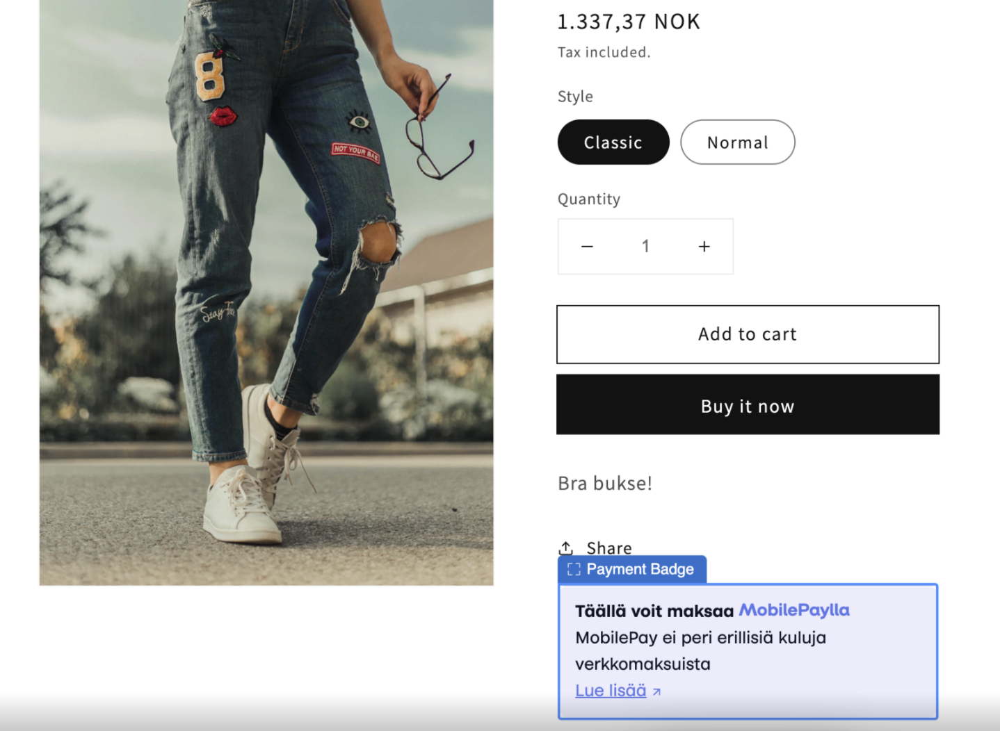

<!-- START_METADATA
---
title: Vipps/MobilePay Companion app for Shopify
sidebar_position: 1
description: Add Vipps/MobilePay branding to your Shopify store.
pagination_next: null
pagination_prev: null
---

import Tabs from '@theme/Tabs';
import TabItem from '@theme/TabItem';

END_METADATA -->

# Companion app for Shopify

  *Available for Vipps and MobilePay.*

*This plugin is built and maintained by [Crude](https://crude.no/).
The plugin is available from the [Shopify app store](https://apps.shopify.com/vipps-companion?locale=nb).
For support, contact [Vipps/MobilePay for Shopify support](https://vipps-shopify.atlassian.net/servicedesk/customer/portal/3).*

<!-- START_COMMENT -->
💥 Please use the plugin pages on [https://developer.vippsmobilepay.com](https://developer.vippsmobilepay.com/docs/plugins-ext/shopify-companion/). 💥
<!-- END_COMMENT -->

Easily add Vipps and MobilePay branding to your store. Add badges on the product pages with drag-and-drop app blocks and add icons in the footer.
This will help you build trust in your store. Many merchants have requested this feature, and now it's finally here.

*Companion app for Shopify* also supports synchronizing relevant order data with the Vipps or MobilePay app
(e.g., product image, price details, shipping, tax, total price).
This gives your customers a lot more information within the app.

The companion app can be used in combination with both the
[Checkout app for Shopify](https://developer.vippsmobilepay.com/docs/plugins-ext/checkout-shopify/)
or [Payment app for Shopify](https://developer.vippsmobilepay.com/docs/plugins-ext/shopify/).

<Tabs className="custom-tabs"
defaultValue="vipps"
groupId="brand"
values={[
{label: 'Vipps', value: 'vipps'},
{label: 'MobilePay', value: 'mobilepay'},
]}>
<TabItem value="vipps">

</TabItem>
<TabItem value="mobilepay">

</TabItem>
</Tabs>

## Support

For issues with the plugin,
contact [Vipps/MobilePay for Shopify support](https://vipps-shopify.atlassian.net/servicedesk/customer/portal/3).
