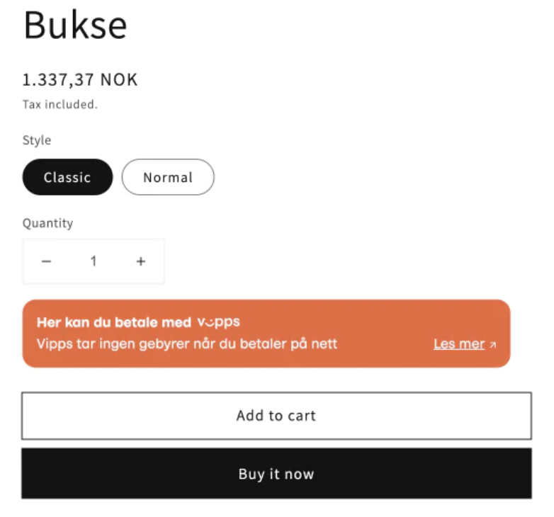
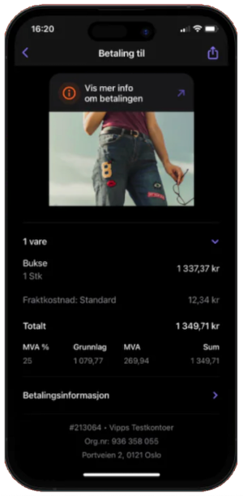

<!-- START_METADATA
---
title: Vipps Companion app for Shopify
sidebar_position: 1
pagination_next: null
pagination_prev: null
---
END_METADATA -->

# Vipps Companion app for Shopify

 *Available for Vipps.*

 *Available for MobilePay in Finland and Denmark in Q1 2024.*

*This plugin is built and maintained by [Crude](https://crude.no/).
The plugin is available from the [Shopify app store](https://apps.shopify.com/vipps-companion?locale=nb).*

<!-- START_COMMENT -->
💥 Please use the plugin pages on [https://developer.vippsmobilepay.com](https://developer.vippsmobilepay.com/docs/plugins-ext/shopify-companion/). 💥
<!-- END_COMMENT -->

**Please note:** Add Vipps branding to your store, and sync order info with the Vipps app.

Easily add Vipps branding to your store, by adding Vipps badges on product-pages with drag and drop app-blocks, together with adding Vipps icon in the footer. This will help you build trust in your store. Many merchants have requested this feature, and now it's finally here! *Vipps Companion* also supports synchronizing relevant order data with the Vipps app, like product image, price details (shipping, tax, total price) which makes it a lot more informative for your customers using the app.

* Easily add Vipps badges using Theme Editor
* Easily add Vipps icon in footer using Theme Editor
* Sync order data with the Vipps app

The companion app can only be used in combination with [Checkout app for Shopify](https://developer.vippsmobilepay.com/docs/plugins-ext/checkout-shopify/).

